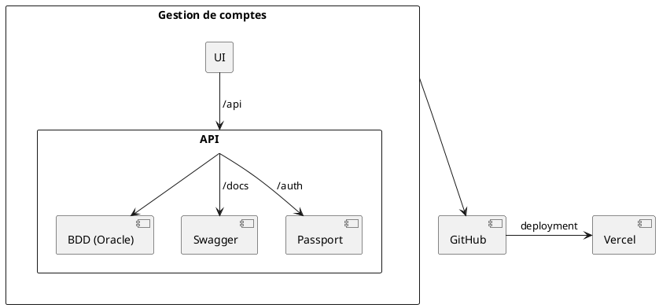
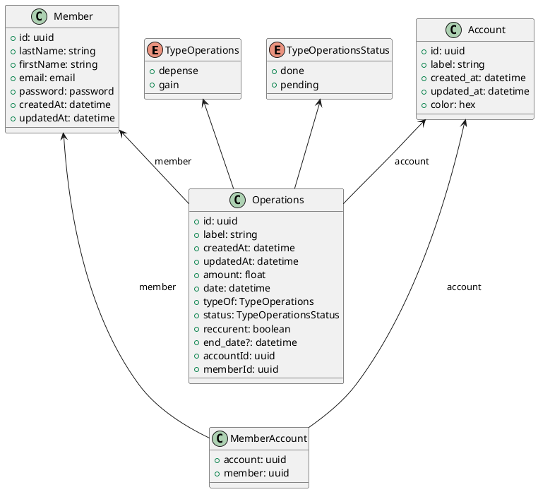

# Gestion bancaire

## Objectifs

- Ajouter / Retirer des opérations
- Ajouter opérations réccurentes (qui se répète à la date X de chaque mois)
- Pouvoir créer des catégories de dépenses et ajouter la catégorie à une opération
- Calculer solde à chaque opération
- Connexion d'un utilisateur à un solde

## Schéma d'architecture

## Structure de données

